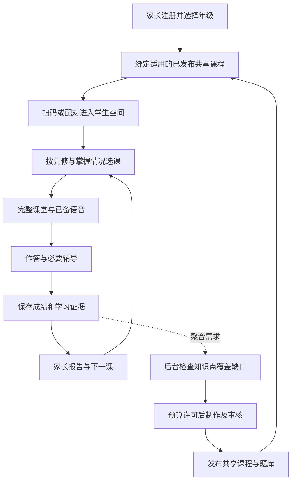

# 小学一至六年级课程、题库与在线辅导实施方案

日期：2026-09-09。状态：待实施方案；本文不代表代码已经补齐、内容已经发布或线上容量已经验收。本轮仅形成方案，没有启动生产 worker 或新增付费调用。

## 1. 推荐决策与目标

采用 **按知识点共享预生成完整课程 + 经校验的题库 + 按学情选课练习 + 有预算保障的实时辅导**。

让新用户注册后直接学习现成课程；AI 持续在后台丰富知识点、讲解情境和题目版本。费用主要随新增内容和实际在线互动增长，注册人数不应直接变成同等数量的整课生成任务。分发、存储和数据库仍有随使用量增长的成本。

优先完成一至六年级共用的工程框架，真实内容按年级、学科和开放单元逐批验收。不能用当前三个首课或每年级几十个变体代表全年覆盖。

本方案延续[共享课程库方案](2026-09-09-prebuilt-course-supply.md)，更新其早期状态与模型选择：当前采用用户选择的 DeepSeek 官方接入，百炼配置保留，不自动切换收费服务。旧方案中的 14/7 天库存、42 门课等均不作为固定目标。

## 2. 当前基础与尚未完成的部分

依据本次代码复核及[当天已保存的本地验收记录](../../output/course-library-supply-2026-09-09/recovery/recovery-report.md)，并非本轮重新执行全流程：

| 范围 | 已有基础 | 尚不能据此作出的结论 |
| --- | --- | --- |
| 一年级 | 三科首课已发布到本地测试库；语文完成到家长报告；数学、英语实际开课并播放讲解 | 三科每一环节均已完整验收、整个自动创作流程稳定、全年已覆盖 |
| 共享课库 | 独立生产所有者、按目标去重、逐门发布、失败记录、限定生产范围 | 用户增长后已有可靠吞吐或完整日费用上限 |
| 二至六年级 | 年级入口及粗主题，部分通用 Pro/skills 能力 | 正式生成、校验、发布和访问全链已经支持；现有各 9 个主题不是完整知识图谱 |
| 在线教学 | 已备音频播放、正式客观题后端判分、按需讨论与问答 | 所有在线调用已有用户/课次/全站预算保护 |
| 等待体验 | 有可学课程时隐藏备课百分比；零课准备中自动更新 | 百分比等于剩余时间或已有可信分钟级生成承诺 |

当前代码明确仍有一年级专用合同、发布与访问限制；二至六年级先修关系尚需建立。当前在线 Agent 单请求回合上限及事后用量记录不等于费用硬上限。

历史验收中的数学研究资料还存在抓取正文乱码，扩库前应补上来源正文可用性校验，不能把抓到 URL 当成资料研究已经合格。

## 3. 内容范围：先通用能力，再映射教材

推荐以教育部公布的课程标准为依据，编制明确的年级能力、学习目标和评价清单；教材版本、上下册、学校教学进度作为后续映射层。引用课标不代表现有内容已逐条对齐，实施时需要建立可审查的映射。[教育部课程方案和课程标准通知](https://www.moe.gov.cn/srcsite/A26/s8001/202204/t20220420_619921.html)

- 覆盖小学一至六年级语文、数学、英语；低年级英语明确作为启蒙范围，不宣称适配所有学校的同步课程。
- 首期自动判分集中于答案可验证的客观题与有明确规则的填写题。作文、开放赏析、自由口语可以另行设计辅导，但在评分标准和验收建立前，不宣称具备可靠自动评分。
- 各年级按起点、先修知识、基础学习、巩固、迁移和后续节点列出开放范围。已有掌握证据者可以跳过已掌握内容，不能随机跳到不具备先修能力的课。
- 教研需要审核知识点清单和首次出现的新题型；新年级首批逐课检查。后续在已验证范围内可自动生产、自动检查，配合抽检、错误反馈和撤回。

### 三层内容资产

| 层 | 保存内容 | 更新方式 |
| --- | --- | --- |
| 知识点与教学规则 | 年级、学科、目标、先修关系、难度范围、常见错误、可接受的评价方式 | 有版本的配置与教研审核；知识点关系应无环且可达 |
| 题库 | AI 原创题、答案、解析、材料证据、题型、难度、错因标签及校验回执 | 小批量生成、独立检查、去重后发布；不需要每增加一道题就重做整门课 |
| 完整课件 | OpenMAIC 场景、讲解、交互、例题、随堂练习、音频、素材来源、课堂完成条件 | 后台完整制作和审核，作为不可变版本发布；已开课会话固定版本 |

题库与课件通过知识点关联。独立练习可从合格题库按难度、错因、近期曝光记录抽取；课内题在制作时选定并绑定答案和讲解。更换课内题必须产生兼容的新课件版本并复验，不能让老师仍讲旧答案。

例如学习 a/o/e 时，教学目标保持稳定，但可有不同故事、例词、游戏和练习。掌握之后进入下一知识点；未掌握者获得适合错因的巩固版本。这样既有变化，也避免每次随机生成完全不同、无法保证教学顺序的内容。

## 4. 从注册到完成学习的用户流程



1. 注册、扫码、读课程列表不直接调用长时备课模型；共享库已有合格内容时立即关联。
2. 首次按年级提供适合起点的课程，可用已有题库做短诊断；诊断可跳过，不能成为另一道冗长门槛。
3. 已有可学课时显示课程卡片，不显示全库备课百分比；零课且确有生产任务时显示真实阶段进度并自动更新。
4. 尚未开放、生产暂停和正在准备是不同状态。没有正在执行的任务不能一直显示“老师正在认真备课”。
5. 完成状态由必要场景、答案及服务器学习事件共同决定；重复提交和断线重连保持幂等。观看完毕、答题完成与已掌握要分别表达。
6. 家长端显示可学、学习中、待继续和报告；预算、模型、重试等细节留给运营端。改年级后读取正确年级课程，保留历史学习记录。

## 5. 自动补库：按覆盖缺口，限制无效生产

课程不会因一个孩子学完而被其他孩子消耗。检查单位是“体系版本 × 年级 × 学科 × 知识点 × 难度/用途 × 变体”，个人状态独立保存。

补库优先级依次为：已开放路径缺首课或当前课 → 合法下一知识点与必要巩固分支 → 后续开放单元 → 常用变体。学生还没学完三个课时，可以按已批准范围补后续缺口，但不能因为每个用户都没学完或刚注册而重复生产。

每个开放知识点至少具有合格核心课程和所需评价；必要补救分支也要有有效内容。究竟需要多少课和题，由知识点复杂度、不同错因及抽题去重要求决定，不能统一用“每年级 27 门”作为教学覆盖。

每年级设置明确 scope、覆盖清单、最大变体数和预算。范围满足即停止扩张；缩小范围不重新激活旧任务。热门需求提高优先级，不能饿死已承诺开放的其他学科或年级。

提前量依据同类任务“入队到合格发布”的 P95、较快学习者的推进速度及故障余量确定。先积累至少 20 个相同流水线版本的有效样本再给初步 P95，之后持续滚动校准；样本少时只展示阶段和实测记录。既不承诺固定生成分钟数，也不把 14/7 天当成万能阈值。

## 6. 生成和质量流水线

建议顺序：

1. **冻结目标**：确定知识点、先修、难度、题型、教学完成条件及内容版本；领取唯一任务和预算。
2. **搜集与校验资料**：课程标准、可靠教学材料优先；检查正文可读性、相关性和来源。网页内容仅作资料，不能当作系统指令。
3. **生成内容与题目**：AI 在范围内创作，保留输入版本、使用的技能和模型记录。
4. **先做低成本检查**：结构、年级、答案、材料证据、重复和题型规则；明显错误在进入昂贵课件/媒体阶段前拒绝。
5. **独立内容复核与 OpenMAIC Pro 制作**：审核与创作职责分开；复用技能、研究材料，生成完整讲解和交互。
6. **检查渲染和教学过程**：页面、按钮、演示、随堂题、标准答案和讲解相互一致；需要修改时保存版本和理由。
7. **生成并验收媒体**：尽量在文本和交互稳定后制作语音；校验可访问、内容匹配及必要媒体完整性。
8. **最终发布门**：冻结稿的独立质量回执、实际课堂回放、媒体、答案绑定均通过后逐门发布。阶段被原生 Pro 合并时也必须保留相同检查点和成本账。

各学科的检查重点：

| 学科 | 必须补齐的验证 |
| --- | --- |
| 数学 | 精确计算、可接受等价答案、数值范围、小数/分数/单位与精度、应用题条件一致性；不能只靠另一个模型说“正确” |
| 语文 | 原创或可使用的材料、字词拼音规范、阅读题材料证据、选项无歧义、解析一致性；开放理解不硬套唯一答案 |
| 英语 | 年级词汇语法范围、拼写和句法、音频与文字匹配、阅读/听力证据；自由表达需要独立评分规则 |

Pro、skills 和必要的联网研究保留在备课流程中，实际调用记录可追溯。联网不必在每个孩子播放课程时重做；图片、视频按教学需要选择，不能把“所有工具都调用过”当成课程质量。

自动审核可能与生成模型一起漏错，因此新年级、新题型和新评分规则需要人工教研检查；稳定范围扩大后仍要抽检和处理学生反馈。质量失败则停在候选区，预算用完不能降低发布门槛。

## 7. 保证教学质量的费用控制

### 7.1 三类工作分别核算

| 工作 | 推荐方式 | 达到预算时 |
| --- | --- | --- |
| 新课、题库、媒体生产 | 按范围后台生产，多人共享；检查点复用 | 暂停新的收费派发，完成不再收费的落库或发布；既有合格内容继续可用 |
| 基础课堂与必要辅导 | 基础讲解/练习尽量预备；明确哪些实时步骤是完成本课必需的，并在开课前预留其费用 | 没有足够预算或服务能力时，不接纳必须依赖这些功能的新课会话；提供事先验收的等价基础路径，或明确保存等待，不能偷偷删教学步骤 |
| 额外追问、延伸讨论、可选媒体 | 按学生需求开启，独立额度与公平使用限制 | 在新一轮开始前说明暂不可用，已有进度、答题和报告继续保存 |

生产池、课堂池共享全站总预算；课堂池区分必要教学与可选扩展。新内容生产与额外扩展不能占用已为正在学习的课堂预留的必要额度。预留只能保障钱数，服务商宕机仍需合理的恢复和课程路径。

“必要辅导”必须在课程合同里有可测试的范围，包括本课典型错因、引导与追问。不能承诺任何问题、任意时长都无限回答，同时保证固定总费用。复杂个例无法在当前服务范围内解决时，保存问题和进度，明确待继续；不能把未解决记为已掌握。

### 7.2 限制的具体边界

- **角色与回合**：按教学目标触发。单老师能够讲清时不额外召集多个角色；对比讨论有教学价值时保留。每轮以问题解决或完整小结结束，不机械套所有年级同一个回合数。
- **上下文**：保留题干、材料、学生原回答、关键错误和已给提示；压缩无关历史与重复角色文本。提取或摘要也有费用，应计账；缓存不能跨学生泄漏私人问答。
- **输出长度**：按年级、题型和难度配置完整教学步骤的范围，预留合理余量。触及技术上限而未完成的响应不得登记为解释完成，可用已验收讲解继续或保存待续，不能把截断文本冒充完整答案。
- **用户/课次/全站限额**：在准入与新一轮开始前检查，保留在途预留；不让一个用户的长对话挤占其他学生已经承诺的基础教学。
- **模型选择**：按角色配置并用相同质量样本比较；先消除重复生成、冗余上下文和无效重试，再考虑便宜模型替换。模型升级或服务商切换不得绕过预算和用户选择。

默认保留现有在线保护；最终回合、上下文和输出阈值，由低/中/高年级、不同题型和多次答错的真实试课校准。验收既看费用，也看正确性、解释完整、纠错成功和等待时间；不能只看 token 降了多少。

### 7.3 统一预算执行

在实际收费调用之前，以数据库事务原子预留全局、用途池以及相应年级/单课/学生额度；调用有持久化 dispatch ID，并绑定课程版本或学生会话。所有 Pro 内部子调用、审核、搜索、图片、TTS、ASR 都必须接入，不能只限制外层一次备课请求。

账本记录 Provider、模型、价格版本、输入/输出及缓存 token、工具次数、音频计量、重试、预留、实际结算、未知费用。采用保守计价、实际结果结算和幂等释放；客户端不能自己上报一个“免费”结果决定预算。

超时或断流且收费结果不明时保留相应预留并进入核查；不能马上全额退回预算再自动重发。关闭页面也不等于 Provider 请求已经取消。旧任务授权、重新尝试和审计不得相互覆盖。

金额精确度取决于真实计量、价格版本和是否覆盖全部收费入口。先同时设置 token/调用/课程/并发硬限制；人民币在无法完全校准时明确标为保守估算。另设全局停派发开关和余额/异常告警。账户在别的应用消费会影响余额，本地账本不等同于服务商实时余额。

固定课程说明及稳定教学规则可以放在重复前缀，观察真实缓存命中；DeepSeek 提供默认启用的上下文缓存，但不能预先假定所有输入都会命中或输出免费。[DeepSeek 上下文缓存文档](https://api-docs.deepseek.com/zh-cn/guides/kv_cache/)

## 8. 成本模型与运营配置

计算完整成本，不能把外层调用次数或单次审核价格当成一门课价格：

```text
月 AI 及相关服务成本 = 当月新内容全链成本（包括媒体、搜索、失败、修复和审核）
                    + 课堂实时模型及其工具成本
                    + 课堂实时语音识别与合成成本

线上总成本 = 月 AI 及相关服务成本 + 应用/数据库/存储/媒体分发等基础设施成本

平均每门合格课程成本 = 本批全部生产成本 / 本批实际合格发布数
每次有效学习成本 = 分摊生产成本 + 该次全部在线调用与媒体成本
```

文本分别核算缓存命中输入、未命中输入与输出；媒体按所选服务的 token、时长、字符或张数等真实规则核算。百炼官方定价按模型列出这些规则，不能给所有服务套一套 token 价格。[百炼模型价格](https://help.aliyun.com/zh/model-studio/model-pricing)

量级示例仅用于说明增长方式：1 万日活、每人每天 5 次互动、每次所有子调用合计 4,000 输入和 500 输出 token，合计约 2.25 亿 token/天，尚未包含媒体和后台备课。这不是本项目实测，也不据此给出人民币报价。

运营配置最少包括：全站日/月预算、生产/课堂分配、开放年级与单元、每年级新增上限、每课生产上限、必要教学包、可选互动额度、全局在途数、故障暂停阈值。日/月周期与价格生效时间明确记录，未结算在途费用不能在跨日时丢失。

本次方案不新增付费授权，不填一个未经实测的“每人五次”或“每天十元”作为最终产品规则。先整理已有调用账，再通过有明确总额和次数上限的试课确定阈值；每个批准批次在额度内自动推进，不要求用户为每次正常子调用重复确认。

## 9. 架构和代码实施边界

保留现有 Flutter 家长端 → Python 业务 API → AI 编排/内容库 → OpenMAIC Runtime/gateway → 学生端结构。生产与在线学习分开调度，个人会话与共享内容分开存储，不进行数据库迁移平台或硬件系统重构。

| 工作包 | 主要文件或新增模块 | 必须实现的结果 |
| --- | --- | --- |
| 年级规则注册 | `backend/content/primary_skill_boundaries.py`；新增年级合同 registry 及各年级数据集；`learning_curriculum_preparation_contract.py` | 六个年级各自完整、版本化的目标与验证；现有一年级已发布指纹不变 |
| 校验与发布 | `learning_catalog_validator.py`、`learning_generated_course_validator.py`、`learning_catalog_release_service.py` | 学科专项规则，发布绑定同一年级、知识点、题目和媒体版本 |
| 生产与隔离 | `course_library_service.py`、`learning_curriculum_preparation_runner.py`、`core/config.py`、`service_factory.py` 及相关 repository | 单公平调度器；grade + fingerprint + build + lease 贯通候选、派发、恢复和发布；缓存按数据库/年级/指纹隔离 |
| 题库与练习 | 新增版本化题库 repository/service、选题策略；关联现有学习评价 | 题库独立增长、重复控制、确定性判分、证据可追踪；不改动已开始课堂题目 |
| 成本控制 | 新增预算策略、reservation/dispatch/usage/reconciliation 服务及迁移；接入 backend 与 OpenMAIC 真实收费入口 | 并发预留、失败对账、预算不足时停止新派发；客户端不能绕过 |
| 年级访问与状态 | `formal_student_learning_access.py`、`learning_curriculum_preparation_service.py`；Flutter learning/preparation models；Student BFF/contracts | 开放范围一致、零课与可学状态一致、扫码资格独立、改年级无串库 |
| Runtime 接入 | `openmaic-runtime/patches/` 及补丁清单、gateway；原生 LLM/Agent/搜索/语音入口 | 修改可在干净原生 checkout 重放；不能只改 `.runtime/OpenMAIC` 临时目录 |
| 运维与验收 | 现有 managed stack、诊断脚本、最小运营页面或 CLI | 一键恢复、暂停/恢复范围、费用/覆盖/失败可见，发布与回滚可检查 |

复用现有数据库去重和租约。生产初期新增一个全局在途限制 1；当前按 build 限 1 不能被当作已经具备全局限制。之后依据实测吞吐和 Provider 限速调整，不能按年级分别启动不受全局限制的 worker。

### 建议 API 与数据合同

以下是拟新增或扩展的语义，接口路径在实施时对齐现有路由，避免再建平行业务域。

- **课程目录/准备摘要**：`gradeCode`、`curriculumVersion`、`availableCourseCount`、`availabilityStatus`（ready/preparing/paused/not_open）、`generationProgress`、`retryAfterMs`。有课可学时仍可内部记录生产状态，前台不显示进度条。
- **课堂启动**：固定 `lessonVersion`、必需教学步骤、`interactionCapabilities` 及服务端预留引用；预算资格由服务端派生，不相信浏览器传入金额或用户身份。
- **在线问答**：会话绑定的 request ID、当前题/场景、输入；返回 streaming/complete/incomplete/temporarily_unavailable 等明确状态。仅完整结果产生解释完成事件，超时不丢学习状态。
- **题库实体**：知识点/题目版本、题型、难度、材料、答案合同、解析、来源、校验回执和发布状态。学生接口按需要返回，答案权威留在服务端。
- **生产实体**：保留 shared owner/request/build，加 grade/curriculum/skill/variant scope 的一致身份及每阶段成本、实际检查点。
- **预算实体**：policy、reservation、dispatch、usage/settlement；唯一键防止重复预留、派发与结算，记录未确定的外部结果。

旧客户端兼容过渡和新版本严格校验应分开设计；不能为了开放高年级而放松一年级既有发布校验或把所有课程总数改成同一个常数。

## 10. 上线承载方式

静态课件和音频走版本化对象存储/媒体分发，保留访问授权；目录聚合状态可缓存，私人回答、成绩、会话不能进公共缓存。API 处理登录、绑定、选课、成绩，worker 处理长任务，在线模型调用使用独立队列和限流。

先复用现有数据库任务机制，不因“以后用户多”立即增加新的消息中间件。扩容以 API、数据库、媒体、模型各自瓶颈为依据，生产队列不能解决实时问答供应商长期容量不足。

准备状态查询按前台活动、退避和随机错峰处理，普通有课用户不持续轮询全库进度。多账号并发注册只增加关联和个人状态，不增加同知识点的整课任务。

容量验收逐级使用模拟模型/固定回放压测，不用真实收费模型做大规模压测；另用小额真实请求验证 Provider 延迟及限流。先测 100 并发，再依据结果扩大到目标规模，100 或 1,000 都是测试档位，不是现有承载承诺。

上线前测量并记录：课程列表和课堂可交互的 P95、错误率、数据库负载、媒体失败率、在线响应时延、每次有效学习成本、各学科可达覆盖。可先把已有内容的目录可见 P95 ≤3 秒作为候选目标，需注明网络/并发/缓存；课堂启动另测，达不到就优化或降低开放规模。

## 11. 推荐实施顺序与每阶段出口

| 顺序 | 实施工作 | 通过条件 |
| --- | --- | --- |
| 1 | 固定当前一年级基线；补数学、英语完整学习到报告验收；补重启、新注册、扫码/配对、断线恢复检查 | 三科真实闭环，问题定位到具体阶段；既有课程可复用，不能靠重新生成掩盖接口错误；真机相机扫码单独验收 |
| 2 | 六年级合同与全链身份隔离；同时补真实调用记账和统一预算控制 | 无付费 fixtures 验证年级/缓存/调度隔离、错误题拒绝、多 worker 抢占预算和一年级旧课兼容；付费入口均受控后再扩库 |
| 3 | 补一年级下一知识点与巩固路径；二年级三科小批试课 | 学完首课能进入合法新内容，未掌握有合适巩固；二年级真实从制作、审核、发布到学习报告通过；付费批次总额和次数明确 |
| 4 | 逐批验证三、四年级，再五、六年级新增题型与教学跨度 | 各年级实际课程和学科规则均受验收，不能用一次低年级成功替代高年级证明 |
| 5 | 为准备开放的年级补齐首个约定教学单元及必要分支，启用范围内自动补缺 | 开放清单覆盖通过；生产失败隔离、库存上限停止、恢复不重复付费、题库抽题有效；三个首课仅为技术试课 |
| 6 | 校准必要教学预算与扩展互动限制；有限用户试运行与故障/负载演练 | 成本与质量同时达标；停生产可学旧课、互动不可用不假完成、个人数据隔离、发布可回滚，然后再扩大范围 |

工程框架按一至六年级设计，内容按通过验收的范围发布。可以先上线已完成的年级和单元；其他年级明确准备中/未开放，不通过入口开关制造“全学段已完成”的印象。

每阶段交付代码差异、已部署版本、真实内容发布清单、关键用户路径结果和费用记录。代码完成、部署完成、内容合格、正式上线是四个不同状态。

## 12. 最终验收清单

1. 100 个同年级账号同时需要同一目标，最多一个对应共享制作任务；已有发布课直接复用。
2. 二、六年级同时注册、改年级、生成和查进度不串数据；旧一年级会话照常完成。
3. 每个开放年级三科的入口、合法下一知识点和未掌握分支都有已验收内容；无先修越级。
4. 客观题答案、解析和课堂讲解一致；已知错误样本必须被拒绝；新年级教研检查、媒体和完整课堂验收通过。
5. 题目与故事能按合格版本变化，近期重复受控，已开始课件不被后台换题。
6. 预算并发争用、重复回调、跨日、重启、断流和未知收费结果均不重复退款或越权重试；所有收费入口有可追踪记录。
7. 必要教学在课前完成预算准入；限额不会静默删除教学步骤、截断后记完成或把未解决记掌握。资金不足与服务故障均有明确状态。
8. 暂停新增备课后，已发布课程、音频、基本答题、进度和报告继续可用；必需在线步骤若依赖外部故障则保存待续，不伪造成功。
9. 真机扫码、新账号、课中断网/重启、再次进入和家长报告都通过；性能指标注明测试条件并达到本次开放规模目标。
10. 每门课和每次有效学习能看到完整实际成本与未结算项；没有费用数据、质量数据或合法覆盖的范围，不扩大自动生产及公开开放。

本方案的成本优势来自共享已验收产物、减少重复工作和按真实需求扩库；必要教学保留资源。它能使增长成本可测、可控，但不能保证无限实时辅导在固定预算内始终可用。
